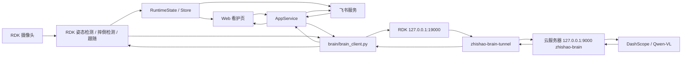

# ZhiShao RDK X5 架构说明

本文记录当前主运行架构。现在 VLM 大脑以云服务器为主，Windows VLM 只作为本地开发备用。

## 组件边界

```text
rdk_app/
```

RDK 主程序运行在 RDK X5 上，负责边缘侧感知、控制和用户交互：
- 摄像头采集：读取本地摄像头画面。
- 姿态检测：使用 RDK 侧 YOLO pose 模型检测人体关键点。
- 摔倒检测：基于姿态、时间窗口和状态机判断风险。
- 人物跟随：通过串口控制云台跟随目标。
- Web 看护页：提供本地和公网看护页面。
- 飞书交互：接收命令、回复状态、推送告警和日报。
- 突发通知：发现摄像头异常、公网异常、VLM 异常或长时间未见人时通知用户。
- 大脑客户端：通过 `brain/brain_client.py` 调用云端 VLM 大脑。

```text
cloud zhishao-brain
```

云端 VLM 大脑运行在云服务器 `127.0.0.1:9000`，负责调用 DashScope / Qwen-VL：
- 接收 RDK 发来的问题、图像或日志。
- 调用 DashScope / Qwen-VL。
- 返回结构化分析结果给 RDK。

```text
windows_brain/
```

Windows VLM 服务开发备用区。主链路不依赖 Windows，只有本地调试 VLM 服务时才需要使用。

## 数据流



## 典型调用链

### 用户问答

```text
飞书或 Web 用户问题
-> RDK AppService
-> brain_client.py 调用 http://127.0.0.1:19000/ask
-> SSH 隧道转发到云服务器 127.0.0.1:9000/ask
-> 云端 VLM 调用 DashScope / Qwen-VL
-> 返回 answer 和 need_image
-> RDK 回复飞书或 Web
```

### 疑似摔倒复核

```text
RDK 姿态检测发现疑似风险
-> 保存或传递现场图像
-> brain_client.py 调用 http://127.0.0.1:19000/analyze
-> 云端 VLM 复核场景
-> 返回 location、risk_level、description
-> RDK 决定是否告警
```

### 隐私复核

```text
用户请求临时查看真实画面
-> RDK 获取当前帧
-> brain_client.py 调用 http://127.0.0.1:19000/privacy_check
-> 云端 VLM 判断是否适合短时开放
-> 返回 safe_to_show、risk_level、reason
-> RDK 根据保护策略开放或拒绝真实画面
```

### 日报总结

```text
RDK 汇总活动日志
-> brain_client.py 调用 http://127.0.0.1:19000/summarize
-> 云端 VLM 生成简短总结
-> RDK 通过飞书或 Web 展示日报
```

## 服务边界

RDK 测试目录：

```text
/home/sunrise/ZhiShao_V2_codex_test
```

RDK 正式目录：

```text
/home/sunrise/ZhiShao_V2
```

RDK 必须常驻：

```text
zhishao-rdk-test
zhishao-tunnel
zhishao-brain-tunnel
```

云服务器必须常驻：

```text
zhishao-brain
zhishao-auth
nginx
```

后续同步到 RDK 时，默认先同步到测试目录，不覆盖正式目录。
